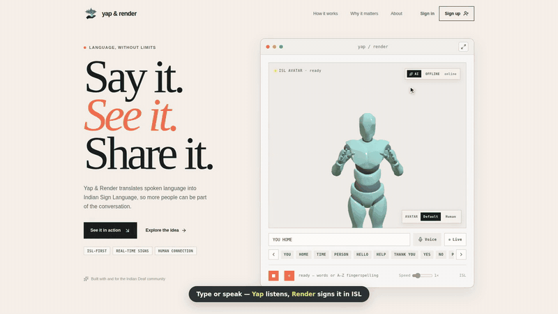
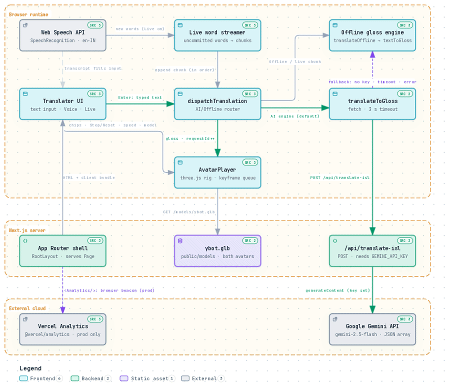

# Yap & Render — Speech/Text to Indian Sign Language (ISL) Translator

Yap converts spoken or typed English/Hindi into Indian Sign Language, signed live by a 3D avatar in the browser. Built for SIH 2026.

## Demo

[](docs/demo/yap-render-demo.mp4)

▶ **[Watch the full demo video (MP4, 2 min)](docs/demo/yap-render-demo.mp4)** — typing sentences, quick signs, A–Z fingerspelling for unknown words, switching to the Human avatar, and the full-canvas view. Recorded with the built-in offline translator (no Gemini key).

## How it works

- **Input**: live speech (Web Speech API streaming) or typed text.
- **Translation**: `app/api/translate-isl` calls Gemini to convert text into ISL gloss. If no `GEMINI_API_KEY` is set (or the API is unreachable), the app falls back to an offline rule-based gloss engine (`lib/islTranslator.ts`, `components/avatar/textToGloss.js`).
- **Signing**: the gloss sequence drives a 3D avatar (`components/avatar/AvatarPlayer.tsx`) built with `react-three-fiber` / `three.js`, playing per-word/per-letter sign animations (including first-person signs and fingerspelling for unknown words).

## Architecture

<a href="docs/architecture/yap-render-architecture-walkthrough.mp4">
  <picture>
    <source media="(prefers-color-scheme: dark)" srcset="docs/architecture/yap-render-architecture-trace-dark.gif" />
    
  </picture>
</a>

Generated with [Archify](https://github.com/tt-a1i/archify) from this repository's source (commit `52fe61f`). Every component and arrow cites the file and line range it comes from, and the diagram passed Archify's validation and real-browser checks.

- ▶ **[Watch the walkthrough (MP4, 51 s)](docs/architecture/yap-render-architecture-walkthrough.mp4)**: source passports, downstream reach, the Translator UI → Gemini path, lenses and themes.
- **[Interactive diagram](docs/architecture/yap-render.html)**: download it and open it in a browser to click components, trace paths and export PNG/SVG.
- Static exports: [light PNG](docs/architecture/yap-render-architecture-light.png) · [dark PNG](docs/architecture/yap-render-architecture-dark.png) · typed source: [`yap-render.architecture.json`](docs/architecture/yap-render.architecture.json)

## Getting Started

```bash
npm install
npm run dev
```

Open [http://localhost:3000](http://localhost:3000).

Optional: copy `.env.example` to `.env.local` and set `GEMINI_API_KEY` (get one at https://aistudio.google.com/apikey) to enable the online translator. Without it, the app still works via the offline fallback.

## Tech stack

Next.js 16 · React 19 · TypeScript · react-three-fiber / three.js · Tailwind CSS · Google Gemini API

## Project structure

- `app/` — Next.js app router pages and API routes
- `components/avatar/` — 3D avatar, sign animations, gloss/text conversion
- `lib/` — ISL translation logic and vocabulary

## Team

Built by Mitarth Pathak, Navneet Singh, Gaurav Soni, Deep Panchal, and Nooren Qureshi.
